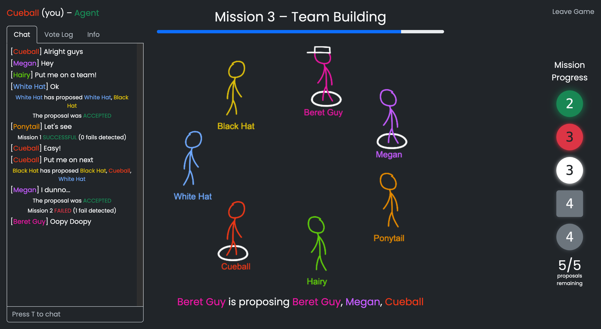

# The Resistance

This is an open source version of the popular party board game [The Resistance][resistance-game], based on original game by Don Eskridge.

**Play it now at [https://resistance.thesilican.com][my-website]**



## About

Similar to party games like Mafia and Werewolf, the Resistance challenges players' skills of deception, lying, and social deduction to determine who to trust. **Agents** try to determine who their teammates are and succeed on missions, while **Spys** must work together to decieve everyone, and fail as many missions as possible. Read the full rules [here][rules].

## Features

- Full online multiplayer support
- Games for 5-10 players
- Easy-to-learn user interface
- Many games can run simultaneously

## Attributions

The original game concept and rules belong to Don Eskridge, the creator of the game. You can buy the original [board game][resistance-amazon] here, and even check out other variations of the game like [avalon][avalon-amazon].

Much of the inspiration for the user interface came from a free-to-play steam game called [MINDNIGHT][mindnight]. You should check it out! It has better graphics, cool music, and you can even save your progress.

## Technologies

The Resistance was build with the following technologies

- Frontend: [React][react], [React Router][react-router], [Bootstrap][bootstrap], [Konva][konva], [Sass][sass], [Create React App][cra]
- Backend: [Node.js][nodejs], [Express][express], [Docker][docker]
- Common: [Redux Toolkit][redux-toolkit], [Socket.IO][socketio], [Typescript][typescript]

## Installation

### Docker

The Resistance is available on Docker Hub. Make sure you have [docker][get-docker] installed, then run:

```
$ docker run -d -p 8080:8080 --name the-resistance thesilican/the-resistance
```

Then you can access the game at `http://localhost:8080`

### Building docker container

If you would like to manually build a container from source, first download the repository. Then run docker build and run the container

```
$ git clone https://github.com/thesilican/the-resistance.git
$ cd the-resistance
$ docker build . -t the-resistance
$ docker run -d -p 8080:8080 --name the-resistance the-resistance
```

Then you can access the game at `http://localhost:8080`

### Node.js/Javascript

If you really want to, you can run the project using [node.js][nodejs] only. It is recommended that you use version `>=12`.

This project has the following directory structure:

```
the-resistance
├─ common
│  └─ src (Redux reducers shared among frontend & backend)
└─ frontend
│  ├─ assets (GIMP image asset files)
│  ├─ public (index.html and generated spritesheets)
│  └─ src (Frontend code)
│     ├─ components (React Components)
│     └─ store (Redux store/selectors)
└─ src (Backend code)
```

The project is split into 3 main portions - frontend, the React.js website; backend, a node.js server; and common, which contains code and types shared between frontend and backend.

Here are the steps to fully build the project:

```
Clone repository from GitHub
$ git clone https://github.com/thesilican/the-resistance.git
$ cd the-resistance

Build common code
$ cd ./common
$ npm install
$ npm run build

Build frontend code
$ cd ../frontend
$ npm install
$ npm run build

Build backend server
$ cd ..
$ npm install
$ npm run build
$ npm start
```

Then you can access the game at `http://localhost:8080`

[my-website]: https://resistance.thesilican.com
[rules]: http://resistance.thesilican.com/how-to-play
[resistance-game]: https://en.wikipedia.org/wiki/The_Resistance_(game)
[resistance-amazon]: https://www.amazon.com/The-Resistance-Dystopian-Universe/dp/B008A2BA8G
[avalon-amazon]: https://www.amazon.com/Resistance-Avalon-Social-Deduction-Game/dp/B009SAAV0C
[mindnight]: http://www.mindnightgame.com/
[react]: https://reactjs.org/
[react-router]: https://reactrouter.com/
[bootstrap]: https://getbootstrap.com/
[konva]: https://konvajs.org/
[sass]: https://sass-lang.com/
[typescript]: https://www.typescriptlang.org/
[cra]: https://create-react-app.dev/
[nodejs]: https://nodejs.org
[express]: http://expressjs.com/
[socketio]: https://socket.io/
[docker]: https://www.docker.com/
[get-docker]: https://docs.docker.com/get-docker/
[redux-toolkit]: https://redux-toolkit.js.org/
[cc-license]: https://creativecommons.org/licenses/by/4.0/
